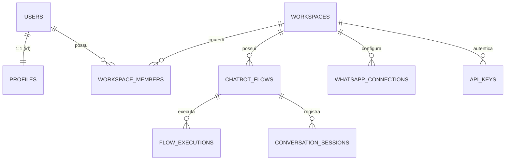

# Documentação Técnica para Integração Externa - Zailom Flow / Builder Flow API

Esta documentação detalha a arquitetura, modelos de dados e fluxos do projeto Zailom Flow, projetada para permitir a integração e sincronização com sistemas externos (ex: Zailom Booking).

---

## 1. Arquitetura de Dados (Supabase)

O projeto utiliza o Supabase como backend, com uma estrutura multi-tenant baseada em Workspaces.

### 1.1 Tabelas Principais

#### `auth.users` (Gerenciado pelo Supabase)
Base de usuários do sistema. A integração externa pode provisionar usuários diretamente via Edge Function.

#### `public.profiles`
Extensão da tabela de usuários.
- `id` (UUID): FK para `auth.users`.
- `slug` (TEXT): Identificador único do usuário.
- `display_name` (TEXT): Nome de exibição.
- `plan` (TEXT): Plano atual (`starter`, `pro`, `business`).
- `embed_source` (TEXT): Origem do provisionamento (ex: `flow-appoint`).
- `embed_company_id` (TEXT): ID da empresa no sistema externo.
- `embed_plan_tier` (TEXT): Plano sincronizado do sistema externo.
- `embed_plan_synced_at` (TIMESTAMPTZ): Data da última sincronização de plano.

#### `public.workspaces`
Unidade organizacional multi-tenant.
- `id` (UUID): PK.
- `name` (TEXT): Nome do workspace.
- `slug` (TEXT): Identificador único na URL.
- `owner_id` (UUID): FK para `auth.users`.

#### `public.workspace_members`
Relacionamento entre usuários e workspaces.
- `workspace_id` (UUID): FK.
- `user_id` (UUID): FK.
- `role` (TEXT): Permissão (`owner`, `admin`, `editor`).

#### `public.chatbot_flows`
Definições dos fluxos dos chatbots.
- `id` (UUID): PK.
- `name` (TEXT): Nome do bot.
- `workspace_id` (UUID): FK.
- `draft_containers` / `draft_edges` (JSONB): Estrutura do editor (nós e conexões).
- `published_containers` / `published_edges` (JSONB): Versão live do bot.
- `is_published` (BOOLEAN): Status de publicação.

#### `public.whatsapp_connections`
Instâncias de WhatsApp conectadas (integração Evolution API).
- `workspace_id` (UUID): FK.
- `instance_name` (TEXT): Nome da instância na Evolution API.
- `status` (TEXT): `connected`, `disconnected`, etc.

#### `public.api_keys`
Chaves de API para acesso externo programático.
- `workspace_id` (UUID): FK.
- `key_value` (TEXT): Valor da chave.
- `is_active` (BOOLEAN).

---

## 2. Estrutura de Permissões e Limites

### 2.1 Permissões (Roles)
- **owner**: Acesso total, incluindo faturamento e exclusão de workspace.
- **admin**: Gestão de bots, membros e configurações.
- **editor**: Criação e edição de bots, sem acesso a configurações administrativas.

### 2.2 Planos e Limites
Os limites são definidos em `src/lib/planResolver.ts` e aplicados via `PlanContext`.

| Plano | Bots por Workspace | Mensagens/Mês | Integrações |
| :--- | :--- | :--- | :--- |
| **Starter** | 1 | 1.000 | 2 |
| **Pro** | 5 | 10.000 | 10 |
| **Business** | 20 | 50.000 | Ilimitado |
| **Suspenso** | 0 | 0 | 0 |

---

## 3. Fluxos de Integração

### 3.1 Provisionamento de Conta (Externo -> Zailom Flow)
Realizado via Edge Function `provision-account`.
- **Endpoint**: `POST /functions/v1/provision-account`
- **Autenticação**: JWT HS256 assinado com `EMBED_SHARED_SECRET`.
- **Payload**:
  ```json
  {
    "email": "user@empresa.com",
    "password": "...",
    "slug": "minha-empresa",
    "display_name": "Nome do Usuário",
    "plan": "pro",
    "company_id": "external-uuid-123"
  }
  ```
- **Ação**: Cria o usuário no `auth.users`, cria o `profile` e gera automaticamente um `workspace` inicial (via trigger `handle_new_user`).

### 3.2 Sincronização de Planos
A Edge Function `sync-embed-plan` é responsável por atualizar o `embed_plan_tier` no Supabase com base em mudanças no sistema de origem (ex: upgrade de assinatura no Zailom Booking).

### 3.3 Fluxo de Cadastro e Login
- **Cadastro**: Pode ser feito via UI (`/auth`) ou via provisionamento externo.
- **Login**: Utiliza o Supabase Auth nativo. Após o login, o sistema detecta os workspaces do usuário via RPC `get_my_workspaces()`.

---

## 4. APIs e Edge Functions Existentes

### 4.1 Edge Functions
- `provision-account`: Criação e setup de contas externas.
- `whatsapp-webhook`: Recebe eventos da Evolution API e aciona o motor do chatbot.
- `chatbot-runtime`: Processa a lógica de execução dos nós (AI, Condicionais, HTTP, etc).
- `crawl`: Motor de raspagem para base de conhecimento.
- `sync-embed-plan`: Sincroniza status de planos externos.

### 4.2 Webhooks
- **WhatsApp Webhook**: Entrada de dados da Evolution API. O Zailom Flow processa a mensagem e responde via Evolution API utilizando as credenciais configuradas em `whatsapp_connections`.

---

## 5. Relacionamentos entre Tabelas



---

## 6. Utilização em Outros Projetos

Para utilizar esta estrutura em outro workspace Supabase:
1. Execute o script `docs/supabase-setup.sql` no Editor SQL.
2. Configure as Variáveis de Ambiente (`EMBED_SHARED_SECRET`, `SUPABASE_SERVICE_ROLE_KEY`).
3. Implemente a chamada para a Edge Function `provision-account` no seu sistema de gestão de clientes.
